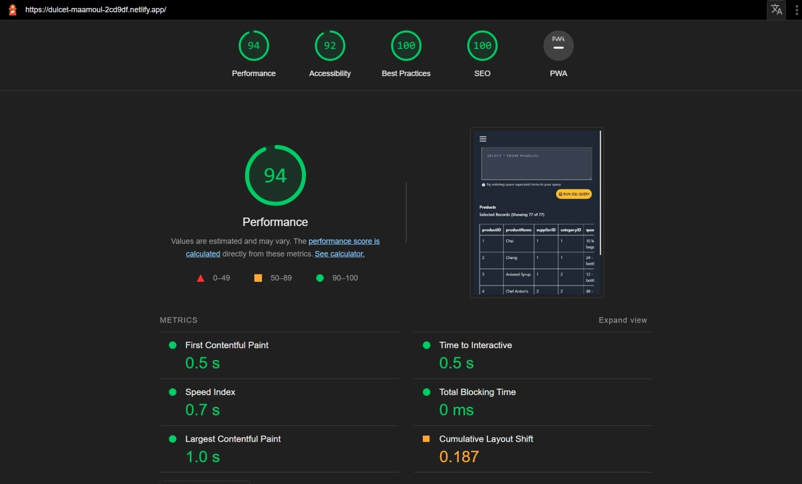
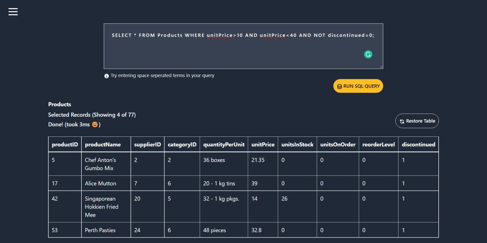
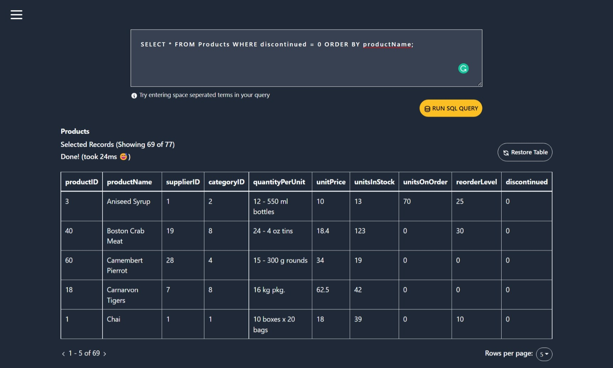
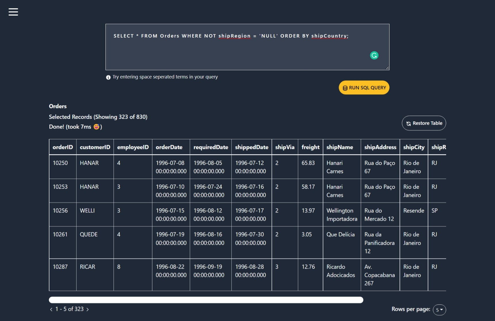
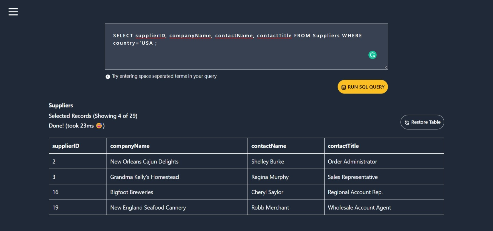

# React & Typescript SQL Editor

An SQL Editor built on React and Typescript.

[Check out the demo](https://dulcet-maamoul-2cd9df.netlify.app/)

## 📝 Todos

- [x] Custom hook for parsing csv files.

- [x] General UI layout with live editor and table.

- [x] Pagination controls for table.

- [x] Mechanism to convert sql code to js/ts logic.

- [ ] Option for exporting data as csv.

- [ ] Dark v Light mode.

<br>

## 📓 Overview

- This repository contains the source code for the task that was given as part of Atlan's frontend hiring challenge.

- The objective was to build a SQL Editor in any JS framework of your choice. I have used React and Typescript. Users should be able to run queries on a set of tables and later export the result as a csv file. 

- As a fun learning exercise, I decided to create my own editor that is capable of parsing and running basic SQL queries.

- The script that has been used here can accept simple select queries with the SELECT and WHERE keywords, followed by any number of conditions (Basic comparisons with <, >, =, <=, >= etc). You can also run queries with the ORDER BY keyword for sorting records w.r.t a given column. 

- There are many limitations to this method, and in a real world scenario, one would have to use a proper editor for writing and running SQL queries.

- The app has been deployed on Netlify and can be found [here](https://dulcet-maamoul-2cd9df.netlify.app/)

- Examples of queries that can be run in this app are shown below (see screenshots)

<br>

## 🔥 Performance

Following is the lighthouse report summary for this webapp.


<br/> 

<br>

## 🎯 Quickstart

- Clone this repository and install the dependencies locally
```
    git clone https://github.com/saket2508/Atlan-Frontend-Challenge-Task.git
    cd Atlan-Frontend-Challenge-Task
    npm install
```

- To start the React App, run the following command from the root directory
```
    npm start
```

- The app should have started on `localhost:3000`

<br>

## 🖼️ Screenshots


<br> 


<br>


<br>


<br>

